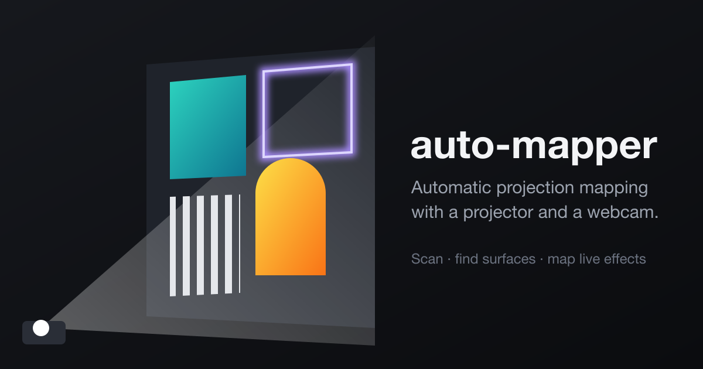

# auto-mapper



Automatic projection mapping with a projector, a USB webcam and a Mac.

auto-mapper is a [Lightform](https://lightform.com/)-style projection mapper (Lightform, the commercial product it is modeled on, is discontinued). You point a projector and a webcam at a scene and press **Scan**. The app projects structured-light patterns, works out which camera pixel sees which projector pixel, and finds the surfaces in the scene: walls, boxes, cabinet doors, corbels. You give each surface a live shader effect, and the projector plays them back, each one clipped to its surface.

A session looks like this:

1. **Scan**: about a minute of black-and-white stripe patterns on the space.
2. **Surfaces**: outlines are detected automatically; you fix, merge, draw or curve them.
3. **Effects**: pick an effect per surface (color fills, outline chases, scan-based tints, images and video) and tune its parameters.
4. **Play**: switch the projector from the editing view to the show, and save it as a project.

Once the scan is done, everything lives in projector coordinates, so playback and saved projects don't need the camera.

## Contents

- [Hardware](#hardware)
- [Install and run](#install-and-run)
- [Using it](#using-it)
- [Scanning tips](#scanning-tips)
- [Troubleshooting](#troubleshooting)
- [How it works](#how-it-works)
- [Development](#development)
- [Limitations and roadmap](#limitations-and-roadmap)

## Hardware

| Part | Requirement |
|------|-------------|
| Computer | A Mac. The hardware probe uses `system_profiler` and AVFoundation (through pyobjc), and camera control uses `uvc-util`, so it is macOS-only today. |
| Projector | Any projector connected as an **extended** display, not mirrored. By default the first non-main display is the projector; with several monitors, pick it in the editor's **Projector** dropdown. |
| Camera | A **UVC USB webcam** that allows manual exposure, white balance and focus. |

**UVC** (USB Video Class) is the standard protocol most USB webcams speak, and it lets software set the camera's exposure, gain, white balance and focus directly.

A scan only works if the camera's picture stays constant between patterns, so auto exposure, auto white balance and autofocus are switched off during a scan and restored afterwards. That is why phone cameras (Continuity Camera) and built-in cameras can't be used for scanning: there's no way to lock their exposure. The app never picks the built-in FaceTime camera, an iPhone or a virtual camera (such as OBS) automatically, and calibration and scanning refuse any camera without a USB address.

The dev rig is an **AC410 4K webcam** and a roughly $100 **VOPLLS** projector (about 300 to 500 real ANSI lumens), which is fine indoors in a dark room. The camera is opened at 3840x2160 by default; a camera that can't do that falls back to its nearest size.

**Outdoor use.** Projector brightness is what limits you outside. As a rough guide, plan on about 3,000 to 4,000 real ANSI lumens for a small wall after dark, and 5,000 or more for the front of a house.

## Install and run

### Prerequisites

- **macOS**, with the projector connected as an extended display.
- **[uv](https://docs.astral.sh/uv/)**. The engine needs Python 3.12 (`requires-python = ">=3.12,<3.13"`); uv installs it for you.
- **Node.js** `^20.19.0` or `>=22.12.0` (Vite 8's minimum) and npm.
- **[`uvc-util`](https://github.com/jtfrey/uvc-util)** on your `PATH`. The engine runs it to read and set camera controls. Without it, calibration and scanning fail.
- **Playwright's Chromium**, only for the browser tests (see [Development](#development)).

### Install

```bash
make install    # uv sync, then npm install in frontend/
```

### Run

```bash
make dev
```

This starts two processes:

| Process | Address | What it is |
|---------|---------|------------|
| Engine (FastAPI + uvicorn) | `http://127.0.0.1:8765` | Camera, scanning, surface detection, show and project storage |
| Editor (Vite) | `http://localhost:5173` | **Open this one.** Vite proxies `/api` and `/ws` to the engine. |

You can also run them separately with `make engine` and `make frontend`.

> **The engine does not auto-reload.** A reloaded worker process couldn't read the webcam (AVFoundation) until the engine was fully restarted, so reload is off. After changing anything in `engine/`, stop `make dev` and start it again. Frontend changes hot-reload as usual.

### Environment variables

All are optional and read by `python -m engine`.

| Variable | Default | Effect |
|----------|---------|--------|
| `AUTO_MAPPER_CAPTURE` | `3840x2160` | Camera capture size, as `WIDTHxHEIGHT`, e.g. `AUTO_MAPPER_CAPTURE=1920x1080 make dev` |
| `AUTO_MAPPER_SCAN_DROP` | `5` | Camera frames thrown away after each pattern appears (stale frames the camera had already buffered) |
| `AUTO_MAPPER_SCAN_SETTLE` | `0.2` | Seconds to wait after each pattern appears, to cover projector input lag |

The scan defaults were tuned on the AC410 at 4K, which delivers about 20 fps and buffers frames. Lower values captured stale patterns (coverage dropped from 0.88 to 0.61 on the same scene).

### Where data lives

Everything is plain files under `~/.auto-mapper/`:

```
~/.auto-mapper/
├── settings.json          selected camera and projector, plus each camera's exposure calibration
├── active-project.json    name and slug of the project last saved or opened
├── camera-restore.json    only while calibration or a scan has the camera locked (or after one
│                          crashed): the camera's original settings, restored automatically
│                          on the next engine start
├── scans/latest/          the working scan, which the editor and output show
│   ├── scan.png           the space as the projector sees it (projector pixels)
│   ├── mask.png           which projector pixels were decoded
│   ├── map.npz            camera-to-projector correspondence map
│   ├── meta.json          scan summary: size, coverage, timing, warnings, detected surfaces
│   ├── scene.json         the show: surfaces with names, outlines, effects and settings
│   │                      (the file keeps its older name so existing projects still open)
│   └── media/             images and videos uploaded for the Image / video effect
└── projects/<slug>/       a saved project: project.json plus copies of the files above,
                           including media/
```

## Using it

### 1. Open the output window

Click **Open output window** in the editor. Drag the new window onto the projector and click inside it to go fullscreen (browsers only allow fullscreen from a click, so the app can't do this for you). The setup hint ("Drag this window onto the projector, then click to go fullscreen.") disappears once the window fills the screen, so it is never projected over the patterns.

The editor's **Hardware** panel shows the projector (a dropdown: with more than one external monitor, pick the one that is the projector; the choice is remembered, and if that display is unplugged the editor says so and falls back to the first non-main display), the camera (a dropdown too: see the next step), whether the output is connected and at what size, and the output's frame rate. Scan stays disabled until the output window exactly matches the projector's resolution. Use **Refresh hardware** after plugging something in.

The **Test frame** buttons (Grid, White, Black) put a test image on the projector, which helps with aiming and focusing.

### 2. Pick the camera

The **Camera** dropdown in the Hardware panel lists every camera, labeled `(USB)`, `(built-in)`, `(external)`, `(phone)` or `(other)`. The first USB webcam is selected by default; your choice is remembered in `settings.json`.

**Show preview** is off by default. While it's on, the editor polls a camera frame twice a second; turning it off releases the camera. Starting a scan turns the preview off, because the scan needs the camera to itself. Use the preview to check that the camera sees the whole projected area.

### 3. Calibrate exposure

Click **Calibrate exposure**. The projector shows full white, the camera's auto controls are locked, and the engine searches for the longest exposure (up to 100 ms) at which the white frame is bright but not clipped. Long exposures brighten the image without the noise that gain adds, and scans don't need speed. Only if the longest exposure is still too dark does it raise gain, step by step.

The result shows as "Exposure N, gain G (white frame peak P)". If it reads **"camera at its light limit"**, the camera is at maximum exposure and maximum gain: the projection is very faint for this camera, so expect poor decoding on dark or distant surfaces.

If you skip this step, Scan calibrates first.

### 4. Scan

Click **Scan**. The projector shows a white frame, a black frame, then Gray-code stripe patterns, each followed by its inverse, for both axes (46 patterns for a 1920x1080 projector). Each pattern is captured as an average of 3 frames to cut sensor noise. This is deliberately quality over speed: a scan takes about a minute on the dev rig. Progress shows below the scan view, and the Scan button becomes **Cancel scan** while it runs.

When it finishes, the editor shows the space from the projector's point of view, the coverage (the share of the projection that decoded) and the time taken. If coverage is under 40%, a warning explains the likely cause: a bright room, faint projection, or a camera that can't see much of the projection. Tick **Show missed areas** to tint the undecoded parts of the projection red.

### 5. Edit surfaces

Detected surfaces appear as numbered outlines over the scan. In the editor:

| To | Do this |
|----|---------|
| Select a surface | Click it. On the projector, the selected surface pulses white so you can find it on the wall. Click again, or click empty space, to deselect. |
| Rename | Type in the name field of the surface panel. |
| Delete | **Delete** in the surface panel. |
| Merge | Shift-click other surfaces, then **Merge N surfaces**. The result keeps the first surface's id and effect. |
| Move a corner | Drag a handle. On a curved run, the neighboring points follow with a smooth falloff, so the curve bends instead of kinking. |
| Add a corner | Double-click an edge of the selected surface. |
| Remove a corner | Alt-click a handle. A surface always keeps at least three corners. |
| Draw a surface | **Draw surface**, then click corners on the scan. Double-click or press Enter to finish, Esc to cancel. Use this for anything detection missed. |
| Detect again | **Redetect** reruns detection on the saved scan. |

The surface panel says where each outline came from: "Detected automatically", "Detected, then edited by you" or "Drawn by you". Redetect and new scans replace only the detected surfaces. Surfaces you drew or edited are kept, new detections that mostly cover one of them are dropped as duplicates, and a new detection that overlaps an old detected surface takes over its id, name and effect, so rescanning doesn't wipe your work.

**Curved outlines.** Detection keeps straight sides as single lines and follows real curves (arches, rounded corbels) with extra points. Handles go on the corners plus a few along each curved run, not on every point.

**Curve an edge** (Bezier editing). Select a surface, click **Curve an edge**, then click near one of its edges. That edge becomes a cubic Bezier curve with two control points, a third and two thirds of the way along it. The outline then shows:

- **anchors** as squares: drag one and the control points beside it move with it;
- **control points** as circles, with tangent lines to their anchors: drag one to bend the curve.

Double-click an edge to add an anchor (a curved edge is split exactly, keeping its shape), and Alt-click an anchor to remove it (its two edges become one straight edge). Press Esc to leave curve mode without picking an edge. Merging surfaces, or editing an outline without its curves, drops the Bezier and keeps the flattened outline.

### 6. Add effects

Pick an effect for the selected surface in the surface panel; its controls appear underneath and changes show on the projector immediately. Switching a surface to a different effect resets its parameters.

| Effect | What it does | Parameters |
|--------|--------------|------------|
| **None (dark)** | Leaves the surface black | none |
| **Fill** | Solid color, or a linear gradient when the two colors differ | Color, Gradient to, Gradient angle (0 to 360), Brightness, React to sound |
| **Outline trace** | A glowing line around the surface's edge, optionally chasing round it | Color, Line width (1 to 40 px), Glow, Chase, Speed (0 to 2 laps/s), Segments (1 to 8), React to sound |
| **Noise flow** | Slowly drifting cloud-like texture between two colors | Color, Second color, Scale, Speed, Contrast, Brightness, React to sound |
| **Tint (scan)** | Recolors the real object while keeping its texture (wood grain, fabric) visible | Color, Texture, Scan gain |
| **Edge glow (scan)** | Glowing lines along the real edges the scan sees: panel grooves, grain, folds | Color, Sensitivity, Line width (1 to 8 px), Base light, Pulse |
| **Posterize (scan)** | Flattens the real surface into a few bands of color, like a screen print | Bands (2 to 8), Dark color, Light color, Scan gain |
| **Text** | Your text, as large as fits inside the surface (or corner-pinned to it), several lines allowed | Text, Color, Background, Font (Sans, Serif, Mono), Align, Fit (Fit inside, Map to corners), Motion (None, Scroll, Pulse), Speed, React to sound |
| **Image / video** | An uploaded image or video, clipped to the surface's outline | Image or video (file); Fit: Cover, Stretch, Map to corners, Contain, Original size, Tile; Zoom, Pan, Rotate, Flip, Background; Video start and speed, Video sound and Volume |

The three "(scan)" effects read the scan image, so they react to what is really on the surface. Image / video accepts PNG, JPEG, WebP, GIF, MP4, M4V, MOV and WebM up to 2 GB; videos loop from their start time, silently unless you turn on **Video sound** (with a Volume). Video sound plays from the output window, through the Mac's selected sound output unless you pick another under **Sound output** in the Sound panel (for example the projector's HDMI audio), so the rest of the Mac's sound can stay where it is. It plays only in Play mode, never during Blackout. If several surfaces show the same video with sound on, it plays once, at the loudest of their volumes. Browsers hold sound back until you click the output window once; the editor tells you when that's needed.

**Framing images and video.**

- **Fit:** Cover fills the surface's bounding box and crops evenly; Stretch fills it exactly; Contain shows the whole image, letterboxed in the Background color; Original size shows one image pixel per projector pixel; Tile repeats the image at original size.
- **Map to corners** (corner pin) warps the image onto the surface's four corners, so it lies flat on a surface seen at an angle, like a poster, instead of being sheared by the bounding box. Orange diamond handles show the four corners (the outline's own until you drag one): drag to pin, Alt-click to reset.
- **On the surface:** with the effect selected, drag inside the surface to pan and scroll to zoom. The Zoom, Pan, Rotate and Flip controls set the same values.

**Apply to all N surfaces** copies the selected surface's effect and parameters to every surface. If you have shift-clicked other surfaces, the button becomes **Apply to N selected** and copies to those only. Each surface gets its own copy, so later tweaks stay per surface.

If an effect's shader fails to compile, its surface is outlined red in the editor (and on the projector while editing), and the surface panel shows the shader log.

### Sound

Effects can follow music. In the **Sound** panel, click **React to sound: off** to turn it on, and pick the input (the default microphone, or an audio interface). The output window does the listening, so it asks for microphone permission once; if the browser holds the sound back, click the output window once. The meter and note show what it hears, or why it can't.

**React to** picks what the effects follow: the **Microphone**, or **Video sound**. Video sound analyzes the videos playing with sound directly, so the effects stay exactly in sync with the video and the mic can't pick up feedback from the speakers or room noise. Turn on Video sound for at least one playing video.

Then raise **React to sound** (0 = off) on an effect:

- **Fill**: dims in silence, brightens with loudness, flashes on beats.
- **Outline trace**: the line thickens on beats and glows with loudness.
- **Noise flow**: swells with the bass and flashes on beats.

Sound is analyzed raw (no echo cancellation or noise suppression), split into bass (20 to 250 Hz), mid (250 Hz to 4 kHz) and treble (4 to 16 kHz), smoothed so effects don't flicker, plus a beat pulse when the bass jumps above its recent average.

### 7. Play

| Control | Button | Key |
|---------|--------|-----|
| Switch between editing and the show | **Play** / **Edit** | `P` |
| Black out the projector, or bring it back | **Blackout** | `B` |

Play hides the selection highlight and error outlines so only the effects are projected. The keys work in both the editor and the output window, and are ignored while you're typing in a field.

### 8. Save and open projects

Type a name under **Project** and click **Save**. This copies the current scan, surfaces, effects and media into `~/.auto-mapper/projects/<slug>/`; saving under an existing name overwrites it. Saved projects are listed below with an **Open** button.

Opening a project replaces the working scan and goes straight to Play. It needs no camera: just the projector, an output window fullscreen on it, and the same projector position as when it was scanned.

## Scanning tips

From real use on the rig:

- **Make the room dark.** Ambient light washes out the stripe patterns. If the black frame is bright, the low-coverage warning tells you to turn off lights or close blinds.
- **Offset the camera diagonally from the projector lens**, not directly below or beside it. Surface detection finds depth edges from parallax between the camera and projector, and parallax along only one axis hides depth edges that run along that axis.
- **Make sure the camera sees the whole projection.** Check with **Show preview** before scanning; anything outside the camera's view can't be decoded.
- **Expect dark or very distant surfaces to decode poorly.** They return too little light for the finest stripes. Draw those surfaces by hand with **Draw surface**.
- **Recalibrate after changes.** Calibrate exposure again after moving the projector, camera or objects, or after changing `AUTO_MAPPER_CAPTURE`.

## Troubleshooting

| Symptom | Cause and fix |
|---------|---------------|
| "Engine not reachable. Is `make dev` running?" | The editor can't reach the engine on port 8765. Start or restart `make dev`. |
| "Camera read failed" (in a scan error or a broken preview) | The engine lost the webcam. Restart `make dev`; the camera is reopened on the next preview, calibration or scan. |
| "Output window not connected..." or "Output window is WxH but the projector is WxH..." | Open the output window, move it onto the projector and click it to go fullscreen. Scanning needs the output to match the projector's resolution exactly. |
| "The output window stopped responding..." during a scan | A minimized or hidden window stops drawing. Keep it visible and fullscreen on the projector, then scan again. |
| "White and black frames look the same to the camera..." | The camera can't see the projection, or it is too dim to register. Check the preview, darken the room, move the projector closer, or raise `AUTO_MAPPER_SCAN_SETTLE`. |
| "Only N% of the projection decoded." | Read the hint that follows it (bright room, faint projection, or camera not seeing the projection), then use **Show missed areas** to see where. |
| "Camera brightness did not respond to exposure changes..." | The camera being controlled may not be the one being read, or the lens is covered. |
| "White frame clips even at the shortest exposure..." | The projection is too bright for the camera. Dim the projector or the room. |
| "Calibration needs a USB webcam with UVC controls" | The selected camera isn't a USB webcam. Pick one marked `(USB)`. |
| "No projector detected..." | Connect the projector as an extended display (not mirrored), then **Refresh hardware**. |

If the engine was killed mid-scan, the webcam can be left with auto exposure off. The next engine start restores its original settings from `camera-restore.json`.

## How it works

### Lockstep capture

The browser output window owns the projector at all times, including during a scan. For each pattern, the engine sends `show_pattern` over the WebSocket, the output draws it and acks after two animation frames (one to draw, one to be sure the previous frame was presented), the engine waits the settle time, drops buffered camera frames, then captures and averages three frames. The camera is locked with `uvc-util` for the whole scan and restored in a `finally` block, with a snapshot on disk for crashes.

### Decoding

Each Gray-code bit is compared with its inverse pattern, so every pixel is judged against its own lighting rather than a global threshold. Bits are read from coarse to fine; once a bit can't be read clearly at a pixel, it and all finer bits are dropped, which bounds the error to that stripe width instead of discarding the pixel (pixels missing more than the three finest bits are discarded). Sub-stripe refinement then recovers positions between the coarse stripes by averaging neighboring pixels, since projector coordinates vary smoothly across the camera image. The result is mapped into projector space (`scan.png`, with small holes filled), and coverage is the share of 8x8 projector-pixel blocks with any decoded data.

### Surface detection

Detection works in projector space and combines three kinds of boundary:

- **depth edges**: neighboring projector pixels whose camera positions jump, because the camera and projector see a depth step from different angles (parallax), which separates surfaces even when they are the same color;
- **color edges** in the scan image;
- **unseen areas** the camera couldn't decode (shadows, occlusion).

The remaining regions above a minimum size become surfaces. Their outlines keep straight sides as single lines and follow sides that really bend (a cubic fits them smoothly, unlike edge noise).

### Effects

An effect is one GLSL ES 3.0 fragment shader plus a parameter schema. The editor builds its controls from the schema, and the output passes each parameter to the shader as a `u_<name>` uniform. A shared preamble (in `frontend/src/effects/compile.ts`) gives every effect:

| Name | What it is |
|------|------------|
| `u_time` | Seconds since the output started |
| `u_resolution` | Projector size in pixels |
| `u_bounds` | The surface's bounding box: x, y, width, height |
| `v_uv` | 0 to 1 across the bounding box |
| `v_pos` | This pixel, in projector pixels |
| `u_poly`, `u_polyCount`, `u_perimeter` | The outline (up to 256 vertices) and its length |
| `polyEdge(p, out along)` | Distance from `p` to the outline, and how far round the outline the nearest point is |
| `scanAt(px)`, `u_scan` | The scan image at a projector pixel |
| `luminance(c)` | Brightness of a color |
| `u_level`, `u_bass`, `u_mid`, `u_treble` | Sound, 0 to 1, smoothed; all 0 when sound is off |
| `u_beat` | 1 on a beat, decaying to 0 over a fraction of a second |

Shaders write to `out vec4 color`. Compile errors are reported back to the editor rather than thrown.

### Module map

**Engine (`engine/`)**

| Module | Role |
|--------|------|
| `__main__.py` | Entry point: reads the environment variables, serves on 127.0.0.1:8765 |
| `app.py` | FastAPI app: all HTTP routes and the `/ws` WebSocket (see [docs/http-api.md](docs/http-api.md)) |
| `hub.py` | Tracks the editors and the output window, pushes status and the show (whenever it changes), pattern acks |
| `hardware.py` | Finds displays (`system_profiler`) and cameras (AVFoundation metadata; never opens a camera) |
| `cameras.py` | Camera catalog, USB address parsing, default camera choice, `settings.json` |
| `camera_device.py` | Opens and reads the selected camera through OpenCV, one at a time |
| `camera_lock.py` | Locks and restores UVC controls with `uvc-util`; crash recovery |
| `calibrate.py` | Exposure and gain search on a white frame |
| `scan_job.py` | Runs scans one at a time: cancel, progress and outcome messages, capture → decode → scan image → coverage → detection; other work holds it with `exclusive()` |
| `scan_runner.py` | The capture part of a scan: pattern loop, frame dropping and averaging, sanity checks |
| `scan_folder.py` | A saved scan on disk (scan image, mask, map, summary, its show, media): save, read, redetect, copy |
| `scan.py` | Gray-code patterns, decoding, projector-space image, coverage, low-coverage hints |
| `surfaces.py` | Surface detection and curve-aware outlines |
| `show.py` | The current show (`CurrentShow`): surfaces, effects, edits, merges, redetect merging; announces every change; play/blackout, sound and selection as session state |
| `projects.py` | Saving and opening named projects |
| `media.py` | Storing and serving uploaded images and videos |
| `messages.py` | Request and WebSocket message shapes (mirrored in `frontend/src/shared/messages.ts`) |
| `files.py` | Atomic file writes |

**Frontend (`frontend/src/`)**

| Module | Role |
|--------|------|
| `editor/main.ts` | The editor page (`index.html`): hardware, camera, scan view, surface editing, effects, projects |
| `editor/statusView.ts`, `scanState.ts` | Turn engine status and scan messages into what the editor shows |
| `editor/curves.ts`, `bezier.ts`, `polygonEdit.ts`, `drawing.ts` | Outline editing: handles on curves, Bezier edges, corner add/remove, drawing |
| `editor/controls.ts`, `applyEffect.ts` | Effect controls from the schema; "apply to" targets |
| `editor/pin.ts`, `framing.ts` | Corner-pin handles; drag-to-pan and scroll-to-zoom framing |
| `output/main.ts` | The output page (`output.html`): patterns, test frames, the animated show, fullscreen hint |
| `output/patterns.ts`, `renderer.ts` | Gray-code stripes (mirrors `engine/scan.py`) and test frames in WebGL2 |
| `output/showRenderer.ts` | Draws every surface with its effect shader, media textures, selection highlight |
| `effects/` | Effect definitions, the registry (`index.ts`), schema types and shader compilation |
| `shared/` | WebSocket connection with reconnect, message types, Play/Blackout keys |

## Development

### Tests

```bash
cd frontend && npx playwright install chromium    # once, for the browser tests
make test
```

`make test` runs:

1. **pytest** (`tests/`): engine tests with fake hardware, fake cameras and synthetic scenes, so no camera or projector is needed.
2. **vitest**, as two projects:
   - **unit**: `src/**/*.test.ts` in Node;
   - **browser**: `src/**/*.browser.test.ts` in headless Chromium with SwiftShader, because shader compilation and rendering need a real WebGL2 context.

**Real-scan fixtures.** `tests/test_real_scan.py` runs regression tests against a real scan of the rig in `fixtures/local/room1/`. That directory is gitignored because it is a scan of a real room; without it those tests are skipped (you'll see them as skipped in the pytest summary).

### CI

GitHub Actions run on every pull request and on pushes to `main`:

- **CI** (`.github/workflows/ci.yml`): engine tests (pytest via uv), and the frontend's type-check, unit and browser tests (headless Chromium) and production build.
- **American spelling** (`.github/workflows/spelling.yml`): the org's [spelling-dialect](https://github.com/ericdahl-dev/spelling-dialect) action fails on British spellings in any tracked text file, including inside identifiers. Web API names such as `AnalyserNode` are allowed, and a line can opt out with `spelling: ok`. Run it locally with `make spelling` (needs pipx). The org ruleset requires the same check on every repo.

To run a workflow locally, use [act](https://github.com/nektos/act) with Docker (or Colima):

```bash
act pull_request -W .github/workflows/ci.yml -j engine -P ubuntu-latest=catthehacker/ubuntu:act-latest --container-architecture linux/amd64
```

act 0.2.89 runs every step but reports a failure in the actions' cleanup ("Post") steps, because it can't run their Node 24 runtime; the job's own steps are what count.

### Adding an effect

1. Create `frontend/src/effects/<name>.ts` exporting an `Effect`: an `id`, a display `name`, a `params` schema, and a `fragment` shader body that writes `color`.
2. Import it in `frontend/src/effects/index.ts` and add it to `EFFECTS`.
3. Add its id to the expected list in `frontend/src/effects/registry.test.ts`, which pins the registry's contents and order.

The editor builds the controls from the schema and the output declares a uniform per parameter. The tests validate every registered effect's schema and compile its shader in the browser project, so `make test` catches a bad parameter or a GLSL error.

Parameter types:

| `type` | Editor control | Shader uniform |
|--------|----------------|----------------|
| `color` | Color picker; default as `#rrggbb` | `vec3 u_<name>` |
| `number` | Slider with optional `min`, `max`, `step` (defaults 0, 1, 0.01) | `float u_<name>`, clamped to the range |
| `choice` | Dropdown of `options` | `float u_<name>`: the chosen option's index |
| `text` | Text box | `sampler2D u_<name>` (the text drawn white on black: use `.r` as a mask, in the effect's `font`/`align` choices if it has them) and `vec2 u_<name>Size` |
| `media` | File upload | `sampler2D u_<name>` and `vec2 u_<name>Size` (pixel size) |
| `quad` | Corner handles on the surface (optional `when`, e.g. `{ fit: "corners" }`) | `mat3 u_<name>`: projector pixels to the quad's 0..1 square (`h = u_<name> * vec3(v_pos, 1.0); uv = h.xy / h.z`); unset uses the outline's corners |

Parameter names must be GLSL identifiers and can't reuse a built-in uniform name (`time`, `resolution`, `bounds`, `scan`, `poly`, `polyCount`, `perimeter`, `level`, `bass`, `mid`, `treble`, `beat`).

A minimal example:

```ts
import type { Effect } from "./types";

/** Fades the surface in and out. */
export const pulse: Effect = {
  id: "pulse",
  name: "Pulse",
  params: [
    { name: "tone", label: "Color", type: "color", default: "#ffffff" },
    { name: "rate", label: "Speed", type: "number", default: 1, min: 0, max: 5, step: 0.1 },
  ],
  fragment: `
void main() {
  float level = 0.5 + 0.5 * sin(u_time * u_rate * 6.2831);
  color = vec4(u_tone * level, 1.0);
}`,
};
```

Effect ids are stored in each project's `scene.json`, so don't rename an existing effect's `id`.

### Other commands

| Command | What it does |
|---------|--------------|
| `make engine` | Engine only |
| `make frontend` | Vite only |
| `make build` | Type-check the frontend and build it into `frontend/dist/` |

## Limitations and roadmap

- **macOS only.** Hardware detection and camera control depend on `system_profiler`, AVFoundation and `uvc-util`.
- **One projector.** A show maps a single projector.
- **iPhone LiDAR depth** as an extra source for plane-based surface detection is an open idea ([#22](https://github.com/ericdahl-dev/auto-mapper/issues/22)).
- **Real-rig validation** of scanning and detection, with a committed scan check and fixture, is in progress ([#15](https://github.com/ericdahl-dev/auto-mapper/issues/15)).

The overall v1 plan is tracked in [#1](https://github.com/ericdahl-dev/auto-mapper/issues/1).
